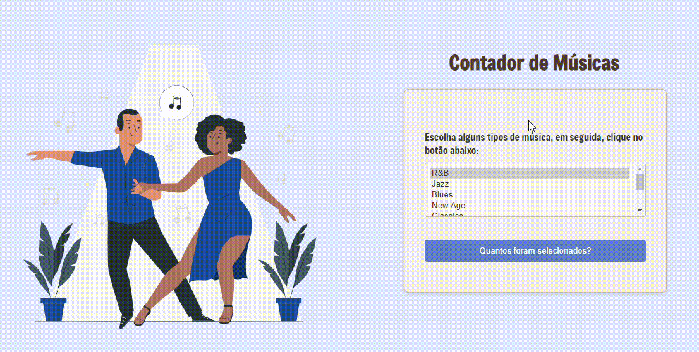

# Projeto aplicando Laços e Iterações

## Índice
* [Descrição](#descrição)
* [Introdução](#introdução)
* [Funcionalidades](#funcionalidades)
* [Técnicas e tecnologias utilizadas](#técnicas-e-tecnologias-utilizadas)
* [Fontes Consultadas](#fontes-consultadas)

## Descrição
- O código HTML define a estrutura básica do formulário, incluindo a lista suspensa ``(select)``, botão ``(input)`` e rótulos ``(label)``. O arquivo CSS ``(style.css)`` cuida da estilização de elementos como layout, cores e fontes.

- O código JavaScript ``(em script.js)`` foca na funcionalidade:

**Função ``howMany:``**
- Recebe um ``selectObject`` (o elemento da lista suspensa) como entrada.
- Inicializa numeroSelecionadas (número de opções selecionadas) como zero.
- Itera por todas as opções no ``selectObject`` usando um loop.
- Para cada opção, verifica se está selecionada ``(selectObject.options[i].selected)``.
- Se selecionada, incrementa ``numeroSelecionadas``.
- Retorna a contagem final ``(numeroSelecionadas)``.

**Evento de clique do botão:**
- Recupera o elemento do botão usando ``document.getElementById("btn")``.
- Anexa um ouvinte de evento de clique ao botão.
- Quando clicado, a função dentro do listener aciona a função ``howMany``, passando o elemento ``document.selectForm``.tipoMusica (a lista suspensa) como argumento.
- A contagem retornada é então exibida em uma caixa de alerta usando ``alert``.

## Introdução
Este projeto HTML fornece uma interface amigável para selecionar vários gêneros musicais. Os usuários podem escolher seus gêneros preferidos em uma lista suspensa e clicar em um botão para ver o número total de seleções exibido em uma caixa de alerta.

## Funcionalidades
- Seleção Múltipla de Gêneros: Os usuários podem selecionar um ou mais gêneros musicais usando a lista suspensa com o atributo ``multiple``.
- Contagem Dinâmica de Seleção: Clicar no botão aciona uma função JavaScript ``howMany`` que itera pela lista de opções e conta o número de itens selecionados.
- Exibição de Alerta: A função howMany retorna a contagem, que é então exibida em uma caixa de alerta usando ``alert``.

## Técnicas e tecnologias utilizadas
* [<code></code>](https://developer.mozilla.org/pt-BR/docs/Web/HTML)
* [<code></code>](https://developer.mozilla.org/pt-BR/docs/Web/CSS)
* [<code></code>](https://developer.mozilla.org/pt-BR/docs/Web/JavaScript)
* [<code></code>](https://git-scm.com/)
* [<code></code>](https://bard.google.com/chat?hl=pt)
* [<code></code>](https://code.visualstudio.com/)
* [<code></code>](https://github.com/)

## Fontes consultadas 
* [Alura - Como escrever um bom README.md](https://www.alura.com.br/artigos/escrever-bom-readme)
* [Bootstrap](https://getbootstrap.com/docs/5.3/forms/checks-radios/#radios)
* [Alura - Tipos de type](https://cursos.alura.com.br/forum/topico-type-do-campo-telefone-104370)
* [Dio](https://www.dio.me/articles/tutorial-criando-um-readme-bonitao-para-o-seu-github)
* [Progamador alternativo - Youtube](https://youtu.be/HJ16WEmOWTw?si=UFvCAtBHbuCc08Hu)
* [Fotos para o subtópico "Técnicas e tecnologias consultadas"](https://github.com/alexandresanlim/Badges4-README.md-Profile)
* [HomeHost](https://www.homehost.com.br/blog/tutoriais/html-buttton/)
* [W3schools](https://www.w3schools.com/js/js_window_location.asp)
* [Site de animações para css](https://storyset.com/search)
* [Paleta de cores para html](https://paletadecolores.online/pt/azul/indigo/)
* [Conversor de MP4 para Gif](https://cloudconvert.com/)

## Autor(a)
|  [ Ana Santos](https://github.com/AnaLu1za) |  
| :---: |

[<code></code>](https://www.linkedin.com/in/ana-luiza-santos-a5032a2a2/)